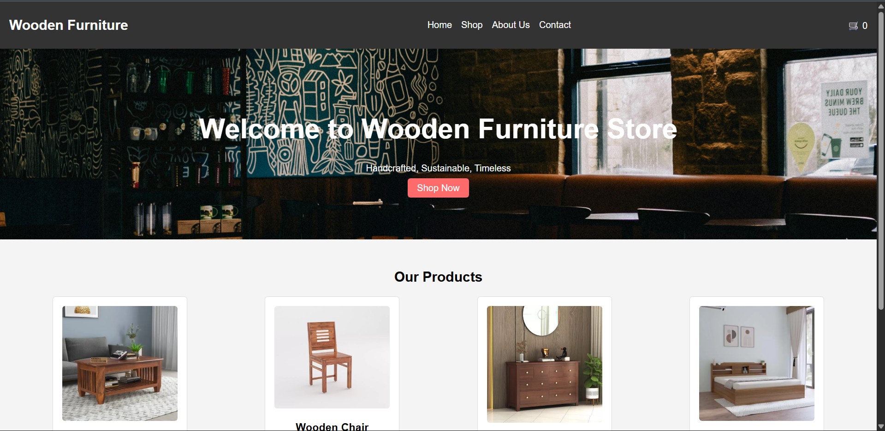

# 🛒 Simple E-Commerce Website

A simple and responsive **E-commerce website frontend** built using **HTML, CSS, and JavaScript**.
This project demonstrates the basic structure and functionality of an online store including product display, navigation, and interactive UI elements.

The goal of this project is to practice **frontend development fundamentals and JavaScript interactivity** while building a real-world style website. Basic e-commerce websites typically include product listings, navigation, and interactive UI components built using HTML, CSS, and JavaScript. ([GeeksforGeeks][1])

---

## 🚀 Features

* 🛍️ Product listing section
* 📱 Fully responsive layout
* 🧭 Navigation menu
* 🖼️ Product cards with images
* 🎨 Modern UI design
* ⚡ Interactive elements using JavaScript

---

## 🛠️ Tech Stack

* **HTML5** – Structure of the website
* **CSS3** – Styling and responsive layout
* **JavaScript (ES6)** – Interactivity and UI behavior

---

## 📂 Project Structure

```
Simple-Ecom-Website
│
├── data
│   └── product-data.json
│
├── images
│   ├── bed.webp
│   ├── cabinet.webp
│   ├── chair.webp
│   ├── hero.jpg
│   └── table.webp
│
├── index.html
├── cart.html
├── script.js
├── cart.js
├── style.css
└── README.md
```

---

## 🌐 Live Demo

(Add your deployed website link here if available)

Example:

```
[https://your-ecommerce-demo.netlify.app](https://wood-ecomm-site.netlify.app/)
```

---

## ⚙️ Installation

To run this project locally:

```bash
git clone https://github.com/SwarajThakre/Simple-Ecom-Website-Using-Html-CSS-and-Js.git
cd Simple-Ecom-Website-Using-Html-CSS-and-Js
```

Then open:

```
index.html
```

in your browser.

---

## 📸 Screenshots

### Homepage



---

## 📚 Learning Goals

This project was created to practice:

* HTML page structuring
* CSS layout and responsiveness
* JavaScript DOM manipulation
* Building a simple e-commerce UI

---

## 👨‍💻 Author

**Swaraj Thakre**

📧 Email: [swarajthakre.stud@gmail.com](mailto:swarajthakre.stud@gmail.com)
💼 LinkedIn: https://www.linkedin.com/in/swaraj-thakre2629
🐙 GitHub: https://github.com/SwarajThakre
🌐 Portfolio: https://swarajthakre26.netlify.app

---

⭐ If you like this project, consider giving it a **star on GitHub**!

[1]: https://www.geeksforgeeks.org/web-tech/building-an-e-commerce-website-code-sections-and-css-features/?utm_source=chatgpt.com "Building an E-commerce Website Using HTML and CSS - GeeksforGeeks"
